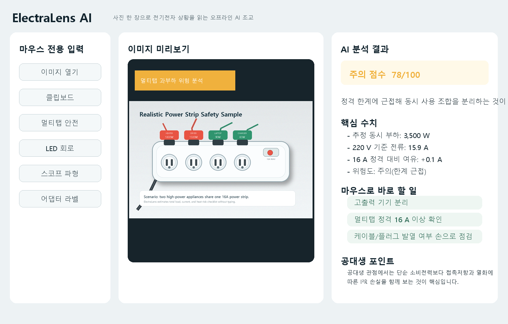

# ElectraLens AI

> 사진 한 장으로 전기전자 상황을 읽는 **오프라인** 데스크톱 AI 조교
> An **offline** desktop assistant that reads electrical/electronic situations from a single photo.


멀티탭 과부하, LED 회로, 오실로스코프 파형, 어댑터 라벨을 인터넷·API 키 없이 분석하고,
전기전자 공식과 연결해 설명합니다. 텍스트 입력 없이 **이미지 + 마우스**만으로 사용합니다.



---

## 한국어

### 핵심 특징
- **오프라인 우선**: 인터넷/API 키 없이 동작. 다른 PC에서도 그대로 실행.
- **마우스 중심**: 이미지 열기 / 클립보드 / 원클릭 샘플 / 모드 선택 / 드래그 프로브.
- **정직한 분석**: 사진만으로 알 수 없는 값은 지어내지 않고 *측정값 / 추정 / 체크리스트*를 명확히 구분합니다.
- **5개 분석 모드**: 자동 · 안전(멀티탭) · 회로 · 파형(스코프) · 라벨(어댑터).
- **스마트 프로브**: 이미지 위를 드래그하면 그 영역만 따로 해석.
- **선택적 OCR**: Tesseract가 설치돼 있으면 라벨/안전 모드에서 실제 정격 수치를 읽어 계산(없으면 자동으로 체크리스트로 폴백).

### 분석 모드
| 모드 | 일반 사용자 | 공대생 |
|------|------------|--------|
| 안전(멀티탭) | 과부하·발열 위험 점검 | P=VI, I²R, 정격전류 |
| 회로(LED) | 회로 정상/위험 이해 | 옴의 법칙, 전력손실 |
| 파형(스코프) | 주기·진폭 의미 파악 | T, f, Vpp, Vrms |
| 라벨(어댑터) | 충전기 호환성 판단 | AC/DC, 출력 정격, 극성 |

### 설치 & 실행
```bash
pip install -r requirements.txt      # Pillow, NumPy
python -m electralens                # GUI 실행
```
샘플로 기능을 바로 확인하려면 GUI 좌측의 "샘플 원클릭" 버튼을 누르세요.

헤드리스(터미널) 사용:
```bash
python -m electralens --smoke-test                      # 샘플 4종 분석 + 검증
python -m electralens --make-screenshots out_dir        # 데모 스크린샷 생성
python -m electralens path/to/image.png                 # 특정 이미지로 시작
```

### 단일 EXE 빌드 (Windows)
```powershell
.\build_exe.ps1        # 결과: dist\ElectraLensAI.exe
```

### 선택적 OCR 켜기
```bash
pip install pytesseract
# + Tesseract OCR 엔진 설치: https://github.com/tesseract-ocr/tesseract
```
설치하면 실제 어댑터 라벨/기기 라벨에서 V·A·W를 읽어 계산합니다. 없어도 앱은 정상 동작합니다.

### 동작 원리
이미지 입력 → 색·에지·밝기 **특징 추출** → 파일명/특징으로 **모드 분류** → 모드별 해석 → 결과 렌더.
- 앱이 생성한 **데모 샘플**은 큐레이트된 정합 수치를 보여줍니다.
- **실제 사진**은 측정 가능한 것만 측정합니다. 예: 스코프 모드는 격자선을 검출하면 div 단위 주기/Vpp를, 아니면 화면 대비 상대값을 정직하게 제시합니다.

### 한계 (정직한 고지)
- 완전한 OCR/부품 인식 모델을 내장하지 않습니다. 실제 사진의 정밀 수치는 OCR(선택)이 있을 때만 산출됩니다.
- 사진만으로 소비전력을 측정할 수 없는 경우(예: 멀티탭) 임의 수치 대신 체크리스트를 제공합니다.
- 스코프 격자 자동 검출은 깨끗한 화면에서 가장 잘 동작하며, 실패 시 상대 측정으로 후퇴합니다.

---

## English

ElectraLens AI analyzes everyday electrical/electronic scenes from a single image — power‑strip
overload, LED circuits, oscilloscope waveforms, and adapter labels — **fully offline**, with no API
keys. It is mouse‑driven: open an image, paste from clipboard, click a sample, pick a mode, or drag a
region to probe it.

### Highlights
- **Offline first** — runs without internet or API keys.
- **Honest analysis** — never fabricates numbers it cannot measure; clearly separates *measured /
  estimated / checklist*.
- **Five modes** — auto, safety, circuit, scope, label.
- **Smart probe** — drag a rectangle to analyze just that area.
- **Optional OCR** — if Tesseract is installed, reads real ratings from labels; otherwise falls back
  to a checklist automatically.

### Install & run
```bash
pip install -r requirements.txt
python -m electralens                 # launch GUI
python -m electralens --smoke-test    # headless self-check
```

### Build a single EXE (Windows)
```powershell
.\build_exe.ps1     # -> dist\ElectraLensAI.exe
```

### How it works
Image → feature extraction (color/edge/brightness) → mode classification → per‑mode interpretation
backed by formulas (P=VI, I=V/R, I²R, f=1/T, Vrms=Vpp/2√2) → rendered result. Built‑in demo samples
show curated values; real photos are measured only where measurement is reliable.

---

## 프로젝트 구조 / Project layout
```
electralens/
  models.py     상수·AnalysisResult 데이터 모델
  features.py   이미지 특징 추출 (NumPy 폴백 포함)
  waveform.py   파형 추적 + 격자선 검출
  analyzer.py   모드 분류 + 모드별 해석 엔진 (UI 비의존)
  ocr.py        선택적 Tesseract OCR 래퍼
  samples.py    데모 샘플 이미지 생성
  probe.py      드래그 영역 스마트 프로브
  report.py     스크린샷 렌더러
  app.py        Tkinter GUI
  cli.py        진입점 / 헤드리스 명령
tests/          pytest 단위 테스트
tools/          아이콘 생성, DOCX 보고서 생성
build_exe.ps1   PyInstaller 빌드
```

## 개발 / Development
```bash
pip install -r requirements.txt pytest
python -m pytest -q
```

## License
MIT — see [LICENSE](LICENSE).

샘플 외 실제 분석에 사용한 웹 이미지 출처는 [web_examples/sources.md](web_examples/sources.md) 참고.
